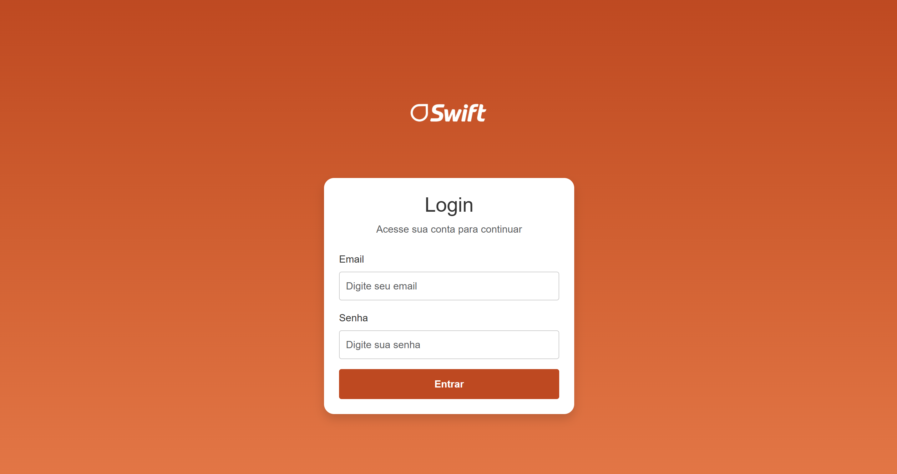

# Swift Gamification – FIAP & JBS Challenge

---

## About the Project
This project was developed as part of the **FIAP + JBS/Swift Challenge**, focusing on **Challenge 2: Gamification to Engage and Boost Results.**  
Our goal is to design a digital solution that makes employees’ experience more engaging and motivating by applying gamification concepts to drive results inside the company.

---

## Project Goal
The system aims to **engage Swift employees** through a gamified environment that brings together:

- **Interactive dashboard** with metrics, charts, and achievements.
- **Login system** for individual access (currently simulated).
- **Gamification features** such as points, ranking, goals, and missions.

---

## Technologies Used
- **Frontend:** HTML5, CSS3, Bootstrap 5
- **Charts & Data Visualization:** Chart.js
- **Icons:** Bootstrap Icons
- **JavaScript** for interactivity

---

## Features Implemented

### 1. Login Page
- Responsive design
- Email and password fields
- Error message for invalid login
- **Simulated authentication** (accepts any credentials for now)

  

---

### 2. Navigation Bar (Global)
- Present on all pages except login
- **Features:**
  - Swift logo on the left
  - Main links: Dashboard, Ranking, Evaluations, Missions, Performance, Achievements, Prizes, Statistics
  - Notification center with dropdown
  - Settings icon
  - Profile picture (desktop only)
  - Mobile menu (hamburger) with all links
- **Responsive design:** Full text links on desktop, simplified icons on mobile

  

---

### 3. Dashboard Page

- **Responsive design** with Bootstrap 5
- **Preloader animation** before content loads
- Navigation bar included on all pages except login

#### Profile Card
- User photo and welcome message
- Performance stats: Sales, Productivity, Quality
- Progress circle with points and goal
- Button: View Full Profile

  

#### Info Cards
- Ranking Position
- Average Evaluation
- Missions Completed

  

#### Daily Goal & Streak
- Daily goal with task checklist
- Progress bar showing completion
- Streak showing consecutive success days

#### Motivational Card
- Performance tips
- Strengths and areas for improvement
- Button: View Improvement Tips

  

#### Achievements Card
- Recent achievements
- Status: Completed / Pending
- Button: View All Achievements

  

#### Ranking Top 3
- Podium with avatars, names, points
- Button: View Full Ranking

#### Voting Card (Prizes)
- List of most desired prizes
- Progress bars showing votes
- Button: Access Voting Form

  

#### Social Feed (Achievements)
- Feed of achievements with posts
- Likes and comments
- Button: Load more posts

  

#### Charts
- Line chart: Sales R$/Units
- Donut chart: Product Categories
- Bar chart: Monthly Sales (Units)
- Bar chart: Monthly Sales (R$)

  

---

### 4. Seller Reviews

- Responsive layout
- Navbar included via `#navbar-placeholder`
- Structure: **Overview** (left) and **Recent Feedbacks** (right)

#### Overview
- Average rating (last 30 days): **4.7 / 5**
- Star distribution (Total: 150)

| Stars | Percentage | Total |
|-------|-----------|-------|
| 5 ⭐   | 75%       | 112   |
| 4 ⭐   | 15%       | 23    |
| 3 ⭐   | 5%        | 8     |
| 2 ⭐   | 3%        | 4     |
| 1 ⭐   | 2%        | 3     |

#### Recent Feedbacks
- Status indicated by color (badge + side border)
  - **5 stars:** bg-success
  - **4 stars:** bg-info
  - **3 stars:** bg-warning
  - **1 star:** bg-danger
- Shows:
  - Client name and ID
  - Review date
  - Feedback title
  - Comment text

  

- Button to load more reviews: `Load More Reviews` with refresh icon

#### Styling & Features
- Rounded cards with light shadow
- Progress bars for star distribution
- Responsive grid using Bootstrap (`col-lg-4` & `col-lg-8`)
- Bootstrap JS for interactivity

---

### 5. Performance Page

This page displays employee performance metrics using **interactive charts** and **tips for improvement**. Users can view annual, monthly, or comparative performance results.

#### Features

- **Performance Chart Card**
  - Dynamic chart displaying results
  - Filters:
    - **Annual:** Default view
    - **Monthly:** Select a specific month
    - **Comparative:** Select two months to compare
  - Chart updates dynamically based on selection

- **Filter Options**
  - Buttons and dropdowns for annual, monthly, or comparative view
  - Comparative mode includes two dropdowns for month selection and a compare button

- **Performance Tips Card**
  - Motivational tips to improve employee performance
  - Includes:
    - ✅ Exemplary customer service
    - ⚠ Increase sales conversion rate
    - ⚠ Improve response time to clients
    - ⚠ Participate more actively in weekly missions

- **Layout & Responsiveness**
  - Bootstrap 5 grid:
    - `col-lg-8` → Chart
    - `col-lg-4` → Tips card
  - Rounded cards with shadow
  - Flexbox for vertical alignment

  

---

### 6. Achievements Page

The **Achievements** page allows employees to track their achievements within the gamified environment. Users can see which goals have been completed and which are still pending.

#### Features

- **Progress Overview**
  - Shows number of achievements completed out of total
  - Progress bar visualizing completion percentage

- **Achievement Cards**
  - Each card represents a specific achievement
  - Status indicators:
    - ✓ Completed
    - ✗ Pending
  - Icons for visual distinction using **Bootstrap Icons**
  - Responsive layout using Bootstrap grid (`row-cols-1 row-cols-md-2 row-cols-lg-4`)
  - Examples of achievements:
    - First Sale Completed
    - Weekly Mission Completed
    - Top Monthly Sales
    - Positive Customer Feedback
    - Reach Top 10 Ranking

- **Styling**
  - Rounded cards with shadow
  - Different colors for completed vs pending achievements
  - Centered text and icons for clean presentation

  

---

### 7. Prizes / Votação de Recompensas

The **Prizes** page allows employees to vote for their preferred rewards based on their ranking in the gamified campaign. Users can see the current leaderboard and choose proposals accordingly.

#### Features

- **Voting Call-to-Action**
  - Prominent button linking to an external voting form
  - Voting period displayed
  - Encourages immediate participation

- **Voting Rules**
  - Select one option per prize category
  - Most voted prize wins in each category
  - Voting is 100% online via external form
  - Displayed with icons and a clean list

  

- **Leaderboard / Partial Results**
  - Shows top voted prizes with progress bars
  - Visual ranking with icons and percentages
  - Examples of prizes:
    - National Trip – 75% votes
    - Latest Generation Notebook – 50% votes
    - Professional Course – 30% votes

  

- **Proposals by Ranking**
  - **1st Place**: highest points – choices include travel or Smart TV
  - **2nd Place**: second highest points – choices include gaming chair or high-performance notebook
  - **3rd Place**: third highest points – choices include premium headphones or professional course
  - Responsive card layout using Bootstrap (`row-cols-1 row-cols-md-2`)
  - Shadowed, rounded cards with clean text

  

- **Styling & Interaction**
  - Progress bars for partial voting results
  - Icons for each prize category
  - Centered action buttons for external form access

---

### 8. Settings / Configurações

The **Settings** page allows users to manage their profile, security, and notification preferences. It is divided into three main tabs for easy navigation.

#### Tabs & Features

1. **Profile**
   - Update profile picture (max 5MB, JPG/PNG)
   - Edit personal information:
     - Full name
     - Role / Department
     - Bio / Status
   - View email (non-editable)
   - Save changes button
   - Responsive layout with photo and form side-by-side

  

2. **Security**
   - Change password:
     - Current password
     - New password (min. 8 characters, letters & numbers)
     - Confirm new password
   - Two-Factor Authentication (2FA) toggle
   - Adds an extra security layer to the account

  

3. **Notifications**
   - Email notifications:
     - Goals & ranking updates
     - New missions & challenges
   - In-app notifications:
     - New achievements
     - Activity on the social feed
   - Toggle switches for each notification type
   - Save preferences button

  

#### Styling & Interaction
- Tabs implemented with Bootstrap nav-tabs
- Rounded, shadowed cards for each settings section
- Responsive design for desktop and mobile
- Clear icons for each tab (Profile, Security, Notifications)

---

### 9. User Profile / Perfil do Usuário

The **User Profile** page provides a comprehensive overview of the user's information, achievements, and activities.

#### Profile Summary
- Large profile picture with rounded design
- User information:
  - Full name
  - Role / Department
  - Bio / Status
- Edit Profile button linking to Settings page
- Responsive layout: summary on the left, data & activities on the right

#### Progress & Activities
1. **Sales Progress**
   - Progress bar showing percentage of sales completed
   - Next goal displayed below chart
   - Chart.js used for visualizing progress over time

  

2. **Achievements**
   - Cards for each achievement displayed dynamically via JavaScript
   - Modal popup for achievement details:
     - Icon
     - Title
     - Description
     - Date

3. **Recent Activity**
   - List of recent actions such as:
     - Awards won
     - Votes cast
     - Goals reached

  

4. **Missions**
   - Daily, Weekly, and Monthly missions
   - Completed and pending tasks distinguished with icons
   - Organized in collapsible sections

  

#### Styling & Interaction
- Rounded, shadowed cards for each section
- Flexible layout using Bootstrap grid and flex utilities
- Interactive achievements with modal details
- Clear visual hierarchy for tasks and progress indicators

---

## Next Steps
- Finalize front-end
- Replace simulated login with real authentication (backend: Python/Flask or Node.js)
- Add gamification system:
  - Points for completed goals
  - Employee ranking
  - Weekly/monthly challenges
- Add notifications and user settings
- Build profile page with customization

---

## Contributors
This project is developed by FIAP students for the JBS/Swift Challenge:

  
  
